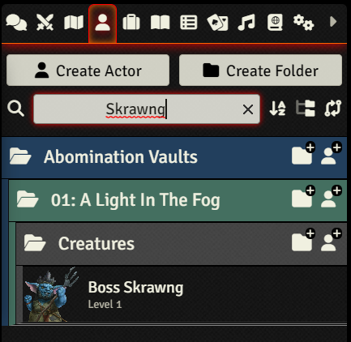
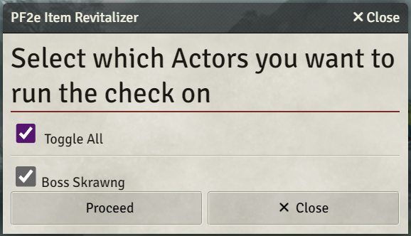
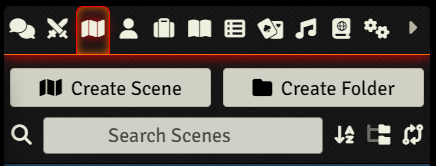

# pf2e-item-revitalizer
Module for handling Item obsolesence after PF2e system updates.
This module performs a likeness check between Items in the PF2e Compendium and the corresponding items (copies) on the Actors in your game.
It compares certain properties of the items and identifies any differences or changes.

There are three components:
- Selection Dialog
  - Lists available Actors to check on
- Revitalizer Checker (Results Dialog)
  - Checks for out-of-date Items
- [Item Revitalizer](#automatic-item-updates)
  - Fixes out-of-date Items by Refreshing from Companion ([with backup solution for Items where Refresh is not allowed](#allow-updating-item-version-from-compendium)).

## Installation
Add `https://raw.githubusercontent.com/robinsving/pf2e-item-revitalizer/main/module.json` or locate the **PF2e Item Revitalizer** in the modules menu

## How to start Character selection

### Run from the Actor Sheet
1. Open up an Actor Sheet
2. Click the Revitalize link in the top bar to run ***Revitalizer Checker*** for this Actor

### Run from the Actor Tab
1. Open up an Actor Tab
2. Optionally, make a search
3. Click the Revitalize link () to create a ***Selection Dialog*** with the current search results
4. Select Actors and click proceed to run the ***Revitalizer Checker*** for the selected Actors

  

### Run from the Scene Tab
1. Open up an Scene Tab
2. Click the Revitalize link () to create a ***Selection dialog*** with the **current** Scene's Actors

## Features

### Check for outdated Items
- Runs a comparison of the Items added to an Actor with the Compendium versions
- Highlights any properties that differ between the Items
- Provides links to easily access the Compendium and Actor Items for further inspection
- Button menu to select further options
#### Resulting dialog with buttons
  - Performs a complete Refresh from Compendium with the **Refresh button** or
  - Performs an [Item update](#automatic-item-updates) with the **Revitalizer button** (backup solution)
  - Hides Items on future runs with the **Hide button**
  - Removes Items with the **Checkmark button** from the results page

### Automatic Item updates using Refresh ()
- Perform an update of an old copy by clicking the Refresh button when you see the check results
- Handles all changes, unless functionality is not available for the item
- Same as clicking Refresh on the Item

### Automatic Item updates using Revitalize () as a backup
- Perform an update of an old copy by clicking the Revitalize button when you see the check results
- Handles many changes, but skips updating properties (e.g. Rule Engine changes) that may cause issues
- *Only shown when the Refresh method is not available*
- [Turned off by default](#allow-refreshing-using-backup-solution).

### Player mode
- GMs can toggle this in [Settings](#gm-only).
- Allows your players to use this mod [from the Actor Sheet title bar](#from-the-actor-sheet)
- Actor ownership is required to use the feature

## Settings

### GM only
By default, the GM is the only one who is allowed to run this module. They have the option to turn it on for Players, but it will be limited _only_ to Actors they own.

### Allow Refreshing using backup solution
Enables [Automatic Item updates](#automatic-item-updates). Off by default, as there is a slight risk that the Item (and in some cases Actor) will have issues.

### Debugging
If you want to [report an issue](#reporting-issues) you may want to [investigate the issue](#using-debug-mode-to-find-issues) first. Turning this on will give you a lot of information on the console log.

### Simplified Rule Element discovery
Simpler Rule change discoveries. Gives fewer false positives, but also misses more true positives

### Ignored Actor Items (client)
The **Hide button** in the results dialog will allow GMs to hide Items on future runs.

### Ignored Item properties (client)
Listing a property here will allow you to ignore certain properties, like "rules" or "icon-link". This will mean faster runs, and no [Automatic Item updates](#automatic-item-updates) for that property.

## Compatibility
This module is designed for use with the PF2e system in Foundry VTT. It is not compatible with other game systems on Foundry VTT

## Limitations
This module is a use-at-own-risk, as updates of Items may have unforseen consequences. There is of course a Setting to toggle the backup-solution, so that you can use this module with the Refresh-parts only.

It should also be noted here that the changes may contain false positives, as well as a lack of true positives. 
The reason for this is that it works on a subset of the real Items' properties, as many of the properties are modified when the Item is added to the Actor.

## Issues

## Reporting issues
If you discover any issues with this module, please create an issue in the Github repo

### Common issues looking like false positives
1. Updates of PF2e icon names Description, e.g. action-glyph are not visible without the debugger
2. Updates of inline rolls, usually from [/r 1d6] to @Damage[1d6] are not visible without the debugger
3. Updates of Item images ("icon-link") to higher quality images are not always easy to spot
4. PF2e sometimes adds values to null-data when an Item is copied to an Actor

### Using debug mode to find issues
- Turn on debug mode in the Settings
- Start the Revitalizer for an Actor
- Check the console.log for the reason an Item ended up where it did
  - Filter the log by the Item slug (name) and you will get both the Actor Item's property and the Origin Items property
- Compare these and to see any differences

## FAQ

### Q. Why can I not use Revitalize on my NPC's sheet?
A. There are limitations to the **PF2e system**, where it comes to Refreshing NPC Items (e.g. Feats).
See [PF2e issue#17573](https://github.com/foundryvtt/pf2e/issues/17573) for more information.

There is still a way to do this, that has been left in the module, by [starting from the Actors' tab](#run-from-the-actor-tab)

## License
This module is licensed under the MIT License. See the [LICENSE](LICENSE) file for more information

## Acknowledgements
This module was created by Robin Sving. If you have any questions, please reach out to me on Github