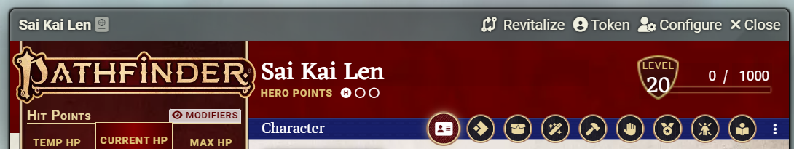
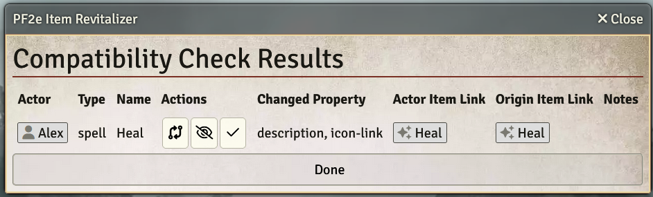

# pf2e-item-revitalizer
Module for handling Item obsolesence after PF2e system updates.
This module performs a likeness check between Items in the PF2e Compendium and the corresponding items (copies) on the Actors in your game.
It compares certain properties of the items and identifies any differences or changes.

## Installation

Add `https://raw.githubusercontent.com/robinsving/pf2e-item-revitalizer/main/module.json` or find it in the modules menu

## Usage

### From the Actor Sheet

1. Open up an Actor Sheet
2. Click the Revitalize link in the top bar

### From the Scene Controls

1. Open your game in Foundry VTT
2. Navigate to the desired Scene where you want to perform the compatibility check
3. Click the pf2e-item-revitalizer icon () in the Scene Control buttons and choose which selection mode to use (all, characters only)
4. Select Actors *from the current scene*

https://github.com/robinsving/pf2e-item-revitalizer/assets/3072502/f29a9951-07cc-44e8-aad9-6d863e8f3df9

## Features

### Check results
- Runs a comparison of the Items added to an Actor with the PF2e Compendium versions
- Highlights any properties that differ between the Items
- Provides links to easily access the Compendium and Actor Items for further inspection
- Button menu to select further options
  - Performs an Item update (see below) with the **Revitalizer button**
  - Hides Items on future runs with the **Hide button**
  - Removes Items with the **Checkmark button**

### Item updates
- Perform an update of an old copy by clicking the Revitalize button when you see the check results
- Handles many changes, but prevents updating of properties (e.g. Rule Engine changes) or item-types (e.g. class) that may cause issues (use manual update for these)

### Player mode
- Toggle in Settings
- Allows your players to use this mod from the Actor Sheet title bar
- Actor ownership is required to use the feature

https://github.com/robinsving/pf2e-item-revitalizer/assets/3072502/70d72dc8-3853-416e-a4e9-8674a46656c9

(this is no longer representative to UI, however, the features are, so I kept the video)

## Compatibility

This module is designed for use with the PF2e system in Foundry VTT. It is not compatible with other game systems on Foundry VTT

## Issues

If you discover any issues with this module, please create an issue in the Github repo

## License

This module is licensed under the MIT License. See the [LICENSE](LICENSE) file for more information

## Acknowledgements

This module was created by Robin Sving. If you have any questions, please reach out to me on Github
